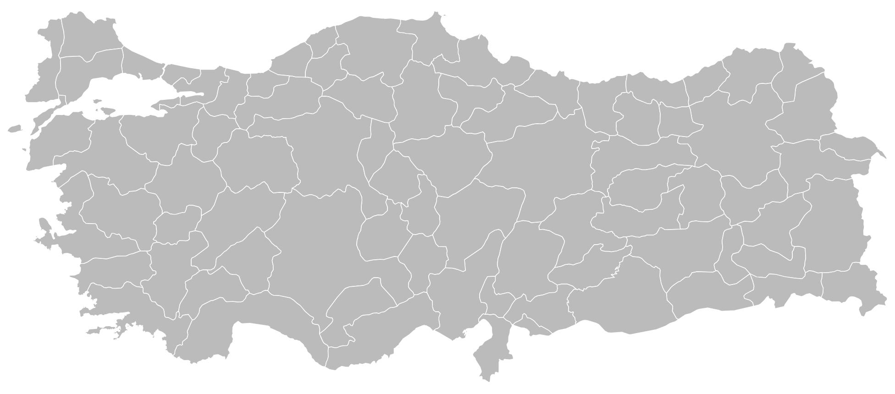
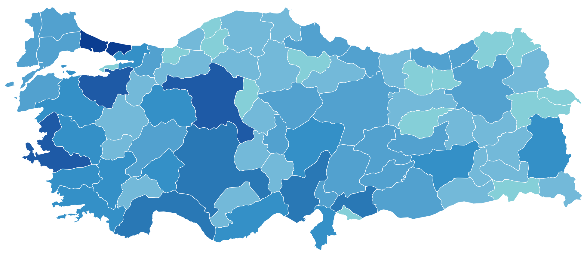

# react-turkey-map

Customizable Turkey map

[](https://www.npmjs.com/package/react-turkey-map)
[](https://github.com/ozgrozer/react-turkey-map/blob/main/license)

## Demo

Basic Map

[PlayCode](https://playcode.io/1891552) - [StackBlitz](https://stackblitz.com/edit/react-turkey-map?file=src%2FApp.jsx) - [CodeSandbox](https://codesandbox.io/p/sandbox/react-turkey-map-kwxylt?file=%2Fsrc%2FApp.jsx) - [Vercel (Next.js)](https://react-turkey-map-basic.vercel.app) - [CodePen (UMD)](https://codepen.io/ozgrozer/pen/JjqWEbe?editors=1000) - [JSFiddle (UMD)](https://jsfiddle.net/ozgrozer/314nLwa2/)

Colorful Map

[PlayCode](https://playcode.io/1891656) - [StackBlitz](https://stackblitz.com/edit/react-turkey-map-lemehe?file=src%2FApp.jsx) - [CodeSandbox](https://codesandbox.io/p/sandbox/react-turkey-map-colorful-ds9tj3?file=%2Fsrc%2FApp.jsx) - [Vercel (Next.js)](https://react-turkey-map-colorful.vercel.app/) - [CodePen (UMD)](https://codepen.io/ozgrozer/pen/pomedbP?editors=1000) - [JSFiddle (UMD)](https://jsfiddle.net/ozgrozer/809cmjav/)

Zoom, Pan & Markers

[JSFiddle (UMD)](https://jsfiddle.net/ozgrozer/hfcgaykz/)

## Preview

Basic Map



Colorful Map



## Installation

Install with NPM

```sh
npm install react-turkey-map
```

## Usage

```jsx
import TurkeyMap from 'react-turkey-map'

export default () => {
  return (
    <TurkeyMap />
  )
}
```

## Props

```jsx
<TurkeyMap
  zoomable
  showTooltip
  minZoom={1}
  maxZoom={40}
  markers={[]}
  colorData={{}}
  clickableCities
  showCityTooltip
  tooltipData={{}}
  showMarkerTooltip
  onCityClick={({ id, plate, city }, event) => {}}
  onMarkerClick={({ id, plate, city }, event) => {}}
/>

// types and defaults
markers: array (default: [])
minZoom: number (default: 1)
maxZoom: number (default: 40)
colorData: object (default: {})
zoomable: bool (default: false)
tooltipData: object (default: {})
showTooltip: bool (default: true)
clickableCities: bool (default: true)
onCityClick: function (default: undefined)
showCityTooltip: bool (default: showTooltip)
onMarkerClick: function (default: undefined)
renderMarkerPopup: function (default: undefined)
showMarkerTooltip: bool (default: showTooltip, false with renderMarkerPopup)

// colorData prop
// plate: city color
colorData={{
  '34': '#071E58',
  '06': '#253494',
  '35': '#253494',
  '16': '#253494',
  '07': '#225EA8'
}}

// tooltipData prop
// plate: city tooltip
tooltipData={{
  '34': '15.655.924',
  '06': '5.803.482',
  '35': '4.479.525',
  '16': '3.214.571',
  '07': '2.696.249'
}}

// markers prop
// placed by real coordinates, on the same projection as the provinces
markers={[
  { id: 'istanbul', title: 'İstanbul', latitude: 41.0082, longitude: 28.9784 },
  { id: 'ankara', title: 'Ankara', latitude: 39.9334, longitude: 32.8597, color: '#1b6ac9' }
]}

// id and title are optional, color defaults to #e2231a
// markers with missing or unparseable coordinates are skipped

// onCityClick and onMarkerClick both hand back the same three keys,
// plus the original click event

// onCityClick prop
onCityClick={({ id, plate, city }, event) => {
  console.log(id, plate, city)
  // 06 06 Ankara
}}

// onMarkerClick prop
onMarkerClick={({ id, plate, city }, event) => {
  console.log(id, plate, city)
  // istanbul 34 İstanbul
}}

// id is what you clicked: the plate for a province, your own id for a marker
// plate and city are the province involved, resolved from the marker's
// coordinates, and are both null for a marker outside every province
// your other marker fields (title, latitude, longitude, color) come along too
```

Without a callback, both log to the console instead, so clicks are visible out
of the box.

## Marker tooltips

Markers get the built-in tooltip on hover, showing their `title`. It follows
the cursor, so it always describes whatever the pointer is over and can never
go stale.

`showTooltip` turns both kinds off. To keep one and drop the other, set
`showCityTooltip` or `showMarkerTooltip`:

```jsx
// markers respond, provinces stay quiet
<TurkeyMap markers={markers} showCityTooltip={false} />
```

For a tooltip on click instead, `onMarkerClick` hands you the click event, so
you can place your own anywhere on the page:

```jsx
import { useState } from 'react'
import TurkeyMap from 'react-turkey-map'

export default () => {
  const [popup, setPopup] = useState(null)

  const onMarkerClick = (marker, event) => {
    setPopup({
      text: `${marker.title} — ${marker.city} (${marker.plate})`,
      top: event.pageY + 12,
      left: event.pageX + 12
    })
  }

  return (
    <div>
      {popup
        ? (
          <div style={{ position: 'absolute', top: popup.top, left: popup.left }}>
            {popup.text}
          </div>
          )
        : null}

      <TurkeyMap
        zoomable
        markers={markers}
        onMarkerClick={onMarkerClick}
      />
    </div>
  )
}
```

A tooltip placed this way stays where it was clicked, so zooming or panning
afterwards leaves it behind while the marker moves on. For one that follows the
marker, hand the map the content instead and let it do the positioning:

```jsx
<TurkeyMap
  zoomable
  markers={markers}
  renderMarkerPopup={marker => (
    <div className='popup'>
      {marker.title} — {marker.city} ({marker.plate})
    </div>
  )}
/>
```

Clicking a marker opens the popup above it and it stays there through zoom,
pan and double click, disappearing once the marker itself is off the map.
Clicking anywhere else closes it. The marker you get is the same one
`onMarkerClick` receives, province and all.

With `renderMarkerPopup` set, the hover tooltip on markers turns itself off, so
you don't get both. Pass `showMarkerTooltip` explicitly if you want them
together.

## Map without clickable provinces

For a map where only the markers respond, turn the provinces off entirely:

```jsx
<TurkeyMap
  zoomable
  markers={markers}
  showCityTooltip={false}
  clickableCities={false}
/>
```

`clickableCities={false}` stops `onCityClick` firing, and drops the pointer
cursor and hover highlight with it, so the provinces read as a backdrop.

## Zoom and pan

`zoomable` is off by default. Turning it on adds:

- mouse wheel zoom around the cursor
- double click to zoom 2x around the cursor
- drag to pan

Province strokes and marker sizes stay constant on screen at any zoom, and the
map is clamped so panning can never expose empty space, so zooming back out to
`minZoom` always brings it back to where it started.

## Map data

The 81 provinces come from [Natural Earth](https://github.com/nvkelso/natural-earth-vector)
10m admin-1 states/provinces (public domain), drawn in Web Mercator and fitted
to a `1007x443` viewBox. Markers use that same projection, so pins and province
shapes always agree.

`src/geoCities.js` is generated. To rebuild it:

```sh
npm run build:geo    # downloads the ~40MB source on first run
npm run verify       # checks the projection, the outlines and the zoom maths
```

## Contribution

Feel free to contribute. Open a new [issue](https://github.com/ozgrozer/react-turkey-map/issues), or make a [pull request](https://github.com/ozgrozer/react-turkey-map/pulls).

## License

[MIT](https://github.com/ozgrozer/react-turkey-map/blob/main/license)
